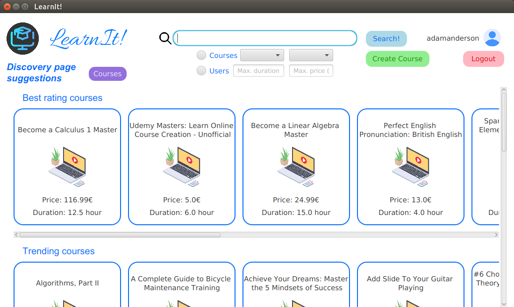

# LearnIt

LearnIt! is an e-learning social network. Users can find courses to follow, read or write reviews about courses and follow other users.

Furthermore users can receive suggestions, on interensting courses or users to follow, based on their tastes.

LearnIt! is designed to handle a large amount of data that is typical of the social-network era, ensuring good performances, with NoSQL database.
In particular the two different databases used in the application are MongoDB (in a cluster of three nodes) and Neo4J. MongoDB is mainly used for storage of users' data and Neo4J for recommendation functionalities.

Here you can find datasets used in this project.
 https://drive.google.com/drive/folders/1OOGafF7gf2bamXVXPgTNMvoj-C9HFSXq?usp=sharing
 
[Here](requirements.pdf) are present the requirements of the project.

The complete documentation is available [here1](documentation.pdf); there is also a presentation of the project [here2](presentation.pdf).

## Main goals are:
- To create an application (in this case with a GUI) that handle a large amount of data using NoSQL databases
- To use real datasets and preprocess them in order to uniform their content

## Project structure
 - `LearnItApp`: the Java(17) application module
 - `DatabaseMaintenance`: the Java(17) module to avoid that documents on MongoDB will become "too large" (>16MB) in order to reduce the documents' dimension

(All the modules are completely configurable with the config.xml file after the validation of its content via config.xsd file)

## Preview

   

